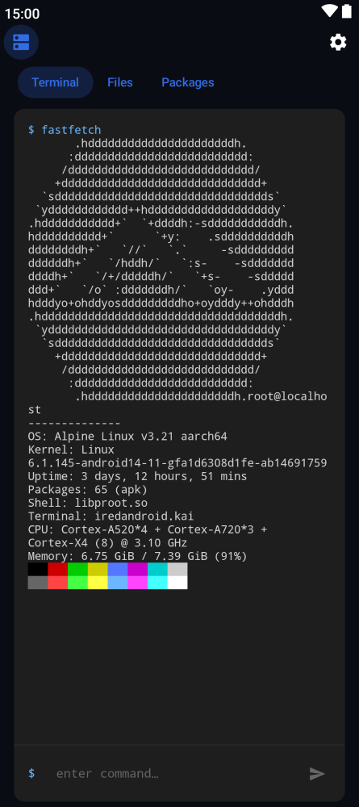
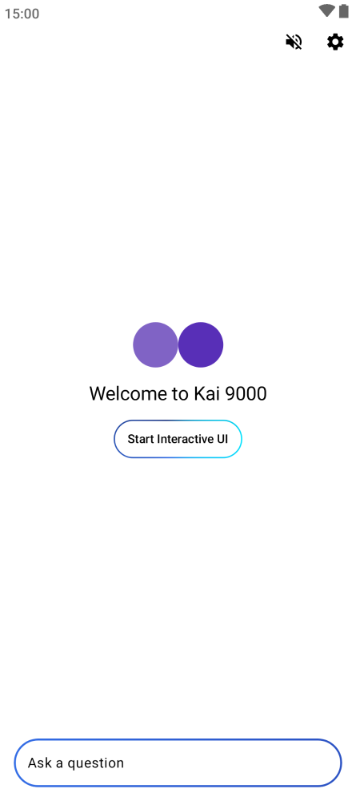

# Kai 9000 - Kali Linux Edition 🐉

 

  

**The Ultimate AI Assistant, Now Powered by a Full Kali Linux Sandbox!**  
This is a specialized fork of the original Kai 9000 app, completely reimagined to integrate a full **Kali Linux** NetHunter environment directly into the Android Sandbox.

**[Download APK](https://github.com/vmanoilov/Kai/releases)** | **[Original Project](https://github.com/SimonSchubert/Kai)**

---

## ⚡ What Makes This Fork Special?

The original Kai AI assistant included a minimal Alpine Linux environment. We thought bigger. 
This version **rips out Alpine** and replaces it with a **full Kali Linux NetHunter rootfs**. 

Why? Because an AI assistant with access to Kali's massive arsenal of networking and security tools is infinitely more powerful. 

### 🔧 Key Modifications
- **Kali NetHunter Rootfs**: Automatically downloads and provisions the official Kali NetHunter environment instead of Alpine.
- **Seccomp Crash Fixes**: Custom patched the `ProotExecutor` to include `PROOT_NO_SECCOMP=1`, ensuring modern `glibc` and system calls work flawlessly on Android without crashing.
- **Direct Terminal Access**: Run `apt update` and access thousands of Kali packages right from your phone, natively, alongside the AI.

Enable it in **Settings > Linux Sandbox** and watch your AI assistant turn into a full-fledged cybersecurity companion!

---

## 📖 About the Original Kai 9000 Project

This project is proudly built on the incredible foundation of **[Kai 9000](https://github.com/SimonSchubert/Kai)** created by **Simon Schubert**. It's a phenomenal open-source AI assistant with persistent memory that runs across virtually every platform.

### Original Features Inherited in this Fork:
- **Persistent memory** — Kai remembers important details across conversations and uses them automatically.
- **Multi-service fallback** — Supports 24 LLM providers with automatic failover (OpenAI, Anthropic, Gemini, Local LiteRT, etc.)
- **Tool execution** — Web search, notifications, calendar events, and of course, shell commands.
- **MCP server support** — Connect to remote tool servers via the Model Context Protocol.
- **Interactive UI** — Generates full interactive screens (quizzes, dashboards, recipes) instead of just plain text.

*Please support the original creator and check out the [upstream repository](https://github.com/SimonSchubert/Kai) for more extensive documentation on the core AI features!*

---

## ⬇️ Installation

You can download the custom Kali-enabled APK directly from this repository's Releases page! The automated GitHub Actions pipeline builds it directly from the source code.

| Platform | Format | Download |
|----------|--------|----------|
| Android | APK | [GitHub Releases](https://github.com/vmanoilov/Kai/releases) |

*(Note: Currently, the custom Kali Linux modifications are exclusively designed for the Android build.)*

---

## 📸 Screenshots

  

---

## 🤝 Contributing & License

This fork is maintained by Vmanoilov. All core AI credits go to Simon Schubert and the open-source community. 
